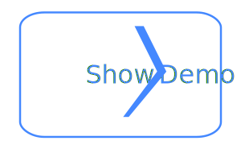

 
<a href='https://github.com/sponsors/StartAutomating'>❤️</a>
<a href='https://github.com/StartAutomating/ShowDemo/stargazers'>⭐</a>

# Showcase your Scripts

Want to showcase something you built in PowerShell?

You can make a .demo.ps1 file to showcase your script line by line, like this:

You can also make a .demo.ps1 file as markdown, like [this](demo.md).

Give it a try!

~~~PowerShell
Install-Module ShowDemo -Scope CurrentUser -Force
Import-Module ShowDemo -Force -PassThru
Show-Demo
~~~

## Writing Demos

Demo files just simple scripts, named either demo.ps1 or *.demo.ps1.

Each comment or statement that starts in the first column is considered a step.

For an example, check out [demo.ps1](https://github.com/StartAutomating/ShowDemo/blob/main/demo.ps1)

## Using the GitHub Action

To use ShowDemo in a GitHub Action, simply add this line to your workflow:

~~~yaml
- uses: StartAutomating/ShowDemo@main
~~~

This will take any demo files and export them as markdown.

## ShowDemo Commands

ShowDemo is a module of few commands.  They are:

|Name|Synopsis|
|-|-|
|Get-Demo   | Gets Demos   |
|Export-Demo| Exports Demos|
|Import-Demo| Imports Demos|
|Resume-Demo| Resumes Demos|
|Show-Demo  | Shows Demos  |

You can Show your demo by running: `Show-Demo -DemoPath .\My.demo.ps1`

Show-Demo is aliased to Start-Demo, it's inspiration

## Inspiration, History, and Goals

In the early days of PowerShell, Jeffery Snover created a useful little script called Start-Demo.

Start-Demo was incredibly useful.

It helped showcase just how cool PowerShell could be, and gave every scripter a simple tool to showcase their scripts.

Start-Demo was written all the way back in PowerShell v1; before the parser API, before markdown, and well before colorized output in Windows Terminal.

ShowDemo is designed to update and replace the old Start-Demo and provide a foundation to give it even more modern capabilities.
